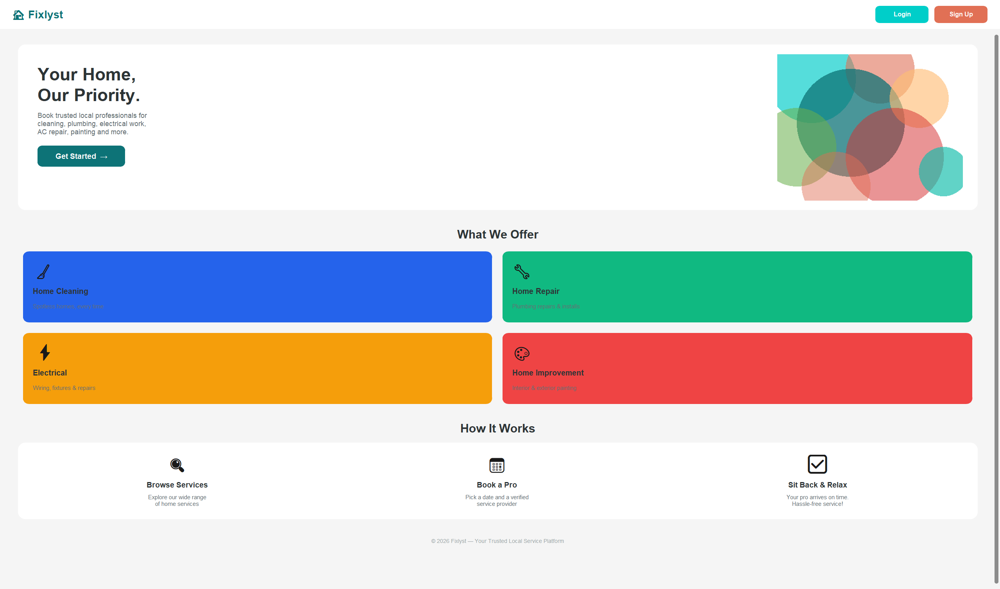

# Fixlyst 🏠

> **Your Home, Our Priority.**  
> A home services booking platform connecting homeowners with trusted local professionals.



---

## Overview

Fixlyst is a full-stack home services marketplace designed to make booking trusted local professionals simple, fast, and hassle-free. Whether you need cleaning, plumbing, electrical work, AC repair, or painting — Fixlyst connects you with verified pros in your area.

The platform was designed end-to-end in Figma and built with Python, focusing on a clean, responsive user experience.

---

## Features

- 🔍 **Browse Services** — Explore a wide range of home services in one place
- 📅 **Book a Pro** — Pick a date and a verified local service provider
- ✅ **Sit Back & Relax** — Your pro arrives on time, guaranteed
- 🔐 **User Authentication** — Secure Login and Sign Up flows
- 📱 **Responsive Design** — Works seamlessly across desktop and mobile

---

## Service Categories

| Category | Description |
|---|---|
| 🧹 Home Cleaning | Routine cleaning, deep cleaning & more |
| 🔧 Home Repair | Plumbing repairs & maintenance |
| ⚡ Electrical | Wiring, fixtures & repairs |
| 🎨 Home Improvement | Paint & exterior coating |

---

## Tech Stack

| Tool | Purpose |
|---|---|
| **Python** | Backend logic & server-side development |
| **Figma** | UI/UX design & prototyping |
| **HTML/CSS** | Frontend structure & styling |

---

## Design

The UI was fully prototyped in **Figma** before development, ensuring a consistent design system with:
- Clean card-based layouts
- Accessible color palette
- Intuitive booking flow
- Mobile-first responsive design

---

## Getting Started

```bash
# Clone the repository
git clone https://github.com/OK-22/fixlyst.git

# Navigate to the project directory
cd fixlyst

# Install dependencies
pip install -r requirements.txt

# Run the application
python app.py
```

---

## Project Structure

```
fixlyst/
├── app.py              # Main application entry point
├── requirements.txt    # Python dependencies
├── static/
│   ├── css/            # Stylesheets
│   └── images/         # Assets & images
├── templates/          # HTML templates
└── README.md
```

---

## Author

**Oluwakayode Rawa**  
MSc Information Systems — Central Michigan University  

[](https://www.linkedin.com/in/oluwakayode-rawa)
[](https://github.com/OK-22)
[](https://ok-22.github.io/OK-22.github.io/)

---

© 2026 Oluwakayode Rawa — All rights reserved
